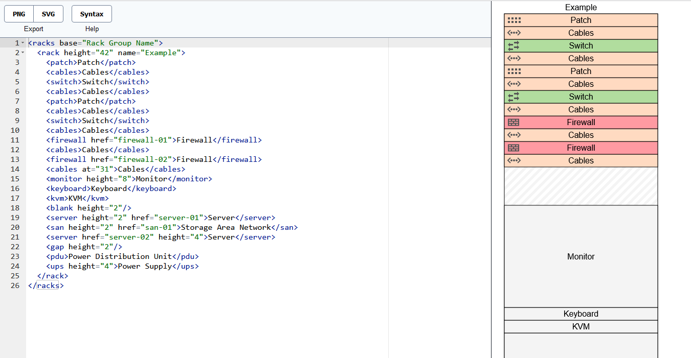
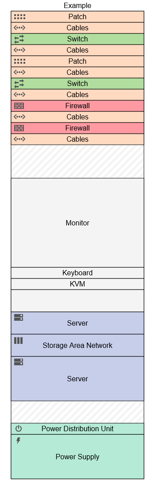

# Rack Elevation Diagram

A web interface for editing rack elevation diagrams using a simple XML-like language.
Renders diagrams to SVG and PNG.

## Screenshot



## Sample RackML

```xml
<racks>
  <rack height="42" name="Example">
  <patch>Patch</patch>
  <cables></cables>
  <switch>switch</switch>
  <cables></cables>
  <patch>Patch</patch>
  <cables></cables>
  <switch>Switch</switch>
  <cables></cables>
  <firewall href="https://kb/firewall-name">Firewall</firewall>
  <cables></cables>
  <firewall href="https://kb/firewall-name">Firewall</firewall>
  <cables at="31"></cables>
  <monitor height="8">Monitor</monitor>
  <keyboard>Keyboard</keyboard>
  <kvm>KVM</kvm>
  <blank height="2"/>
  <server height="4" href="https://kb/server-name">Server</server>
  <san height="2" href="https://kb/san">SAN</san>
  <server href="https://kb/server-name" height="4">Server</server>
  <gap height="2"/>
  <pdu></pdu>
  <ups height="4">UPS</ups>
  </rack>
</racks>
```

## Sample PNG



